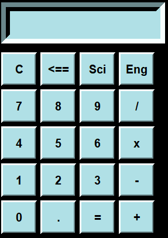
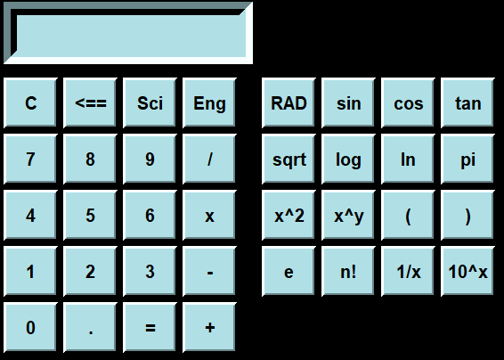
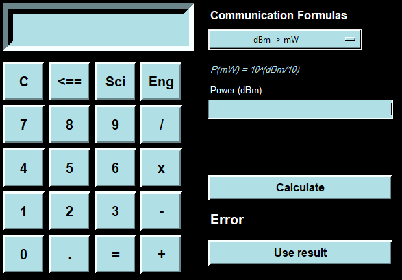

# Calculator

A Python desktop calculator built with Tkinter, combining basic arithmetic, scientific functions, and selected communication engineering formulas.

## Features

### Basic Calculator

* Addition
* Subtraction
* Multiplication
* Division
* Decimal calculations
* Clear display
* Backspace

### Scientific Calculator

* DEG / RAD angle modes
* Sine
* Cosine
* Tangent
* Square root
* Common logarithm (`log`)
* Natural logarithm (`ln`)
* Pi (`π`)
* Euler's number (`e`)
* Factorial
* Powers
* Reciprocal
* Parentheses

### Communication Engineering Calculator

The calculator also includes a dedicated panel for selected communication engineering formulas:

* Power ratio → dB
* Voltage ratio → dB
* dB → Power ratio
* dBm → mW
* mW → dBm
* Wavelength
* Shannon capacity
* Free-space path loss
* Nyquist rate
* PCM bit rate

## Screenshots

### Main Calculator



### Scientific Calculator



### Communication Engineering Calculator



## Technologies

* Python 3
* Tkinter
* `math`
* `re`

## How to Run

### Requirements

* Python 3.x
* Tkinter

Tkinter is used for the graphical user interface.

### Run the Application

Clone the repository:

```bash
git clone https://github.com/Jaafar-Daoud-AC/Calculator.git
```

Navigate to the project directory:

```bash
cd Calculator
```

Run the application:

```bash
python calculator.py
```

## Project Structure

```text
Calculator/
├── calculator.py
├── README.md
└── screenshots/
    ├── calculator-main.PNG
    ├── calculator-scientific.PNG
    └── calculator-engineering.PNG
```

## Project Status

**Completed — Future improvements may be added.**

## Author

**Jaafar Daoud**

Applied Communications Engineer

GitHub: [Jaafar-Daoud-AC](https://github.com/Jaafar-Daoud-AC)
